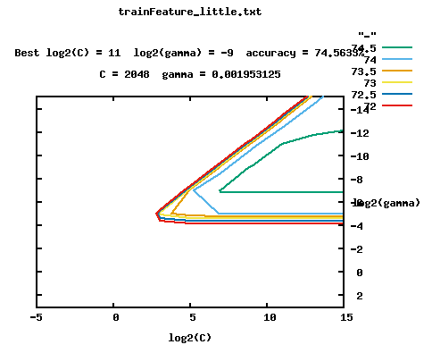
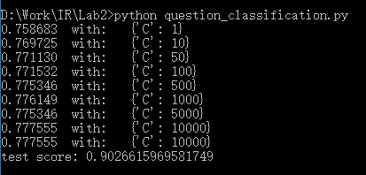

# 信息检索实验： 问答系统设计与实现

## 一、实验目的
本次实验目的是对问答系统的设计与实现过程有一个全面的了解。实验主要内容包括：对给定的文本集合进行处理、建立索引；找出问题的候选答案句并排序；答案抽取，逐步调优。

## 二、实验内容
本次实验中，首先要自己建立一个检索系统，从文本库中检索到与问题最相关的文档（可以是一个或者多个）。然后对文档中的候选答案句进行排序，抽取出最相关的候选答案句。最后，在最相关的候选答案句中抽取最精简的答案，这个答案可能是一个词或者几个词。实验提供了一部分有标注的数据作为训练集和开发集，需要提交的那部分是去掉了标注的数据，最终通过提交的答案和标准答案的相似度（BLEU-1 值）来评价本次实验的效果。

## 三、实验过程及结果

### 3.1 文本集合进行处理、建立索引
我在此章节分别使用了Whoosh开源库和BM25算法构建索引，效果上略有差异，Whoosh的top1值为86%，top3为91%，BM25的top1为89%，top3为93%，BM25较优于Whoosh，具体讲解如下。

#### 3.1.1使用开源库Whoosh构建索引
在开始使用whoosh之前，需要一个index对象，在第一次创建index对象时必须定义一个Schema对象，Schema对象列出了Index的所有域。一个域就是Index对象里面每个document的一个信息，比如它的题目或者它的内容。一个域能够被索引（就是能被搜索到）或者被存储（就是得到索引之后的结果，这对于标题之类的索引非常有用）。
```
# 定义schema
schema = Schema(id=ID(stored=True), document=TEXT(stored=False))
```
一旦有了schema对象，就可以用create_in函数创建索引：
`ix = create_in(data_path.index_dir, schema)`

有了索引对象现在我们可以添加文本。这里添加的文本已经过分词处理（这里使用的是jieba分词，实验多次尝试证明jieba分词的效果要优于ltp）。索引对象的writer()方法返回一个能够让你给索引添加文本的IndexWriter对象，IndexWriter对象的add_document()方法接受关键字参数。
```
writer = ix.writer()
# 读取json文件
with open(data_path.passages_segment, 'r', encoding='utf-8') as fin:
    docs = [json.loads(line.strip()) for line in fin.readlines()]
# 加入索引
for doc in docs:
    writer.add_document(id=str(doc['pid']), document=' '.join(doc['document']))
writer.commit()
```
在搜索文本之前，我们需要一个Searcher对象，这里使用with表达式来打开搜索对象以便searcher对象能够自动关闭。Searcher对象的search方法使用一个Query对象，可以直接构造query对象或者用一个query parser来得到一个查询语句，QueryParser构造器的第一个参数是默认的搜索域，这通常是“正文文本”域，第二个可选参数是用来理解如何parse这个域的schema对象，一旦你有了Searcher和query对象，就可以使用Searcher对象的search()方法进行查询并且得到一个结果对象。
```
index = open_dir(data_path.index_dir)
with index.searcher() as searcher:
    # TODO 采用Or操作，可优化
    parser = QueryParser("document", schema=index.schema, group=syntax.OrGroup)
    query = parser.parse("罗静恩 韩文 名字 是 什么")
    results = searcher.search(query)
    for hit in results:
        print(hit)  # hit.highlights("document")没有store
```

#### 3.1.2 BM25构建索引
BM25其实只用到了一些基础的统计和文本处理的方法，没有很高深的算法.

上图是BM25的公式，对于一个搜索q和所有文本，计算每一篇文本d的权重。整个公式其实是TF-IDF的改进：
- 第一项是词w的逆文档频率，N是所有文本的个数，dft是出现词t的文本个数
- 第三项是搜索q中词t与q的相关性，是词项t在查询中的权重，是一个取正值的调优参数，对查询中的词项频率进行缩放控制。由于本次实验的数据集中的问题不是很长，这一项可以忽略。
- 中间的第二项是关键，实质是词t的TF值的变换，是词t在文本d中的权重，和分别是文档d的长度及整个文档集中文档的平均长度；是一个调优参数，对文档中的词项频率进行缩放控制，如果=0，则对于BIM模型，如果取较大值，那么对应于使用原始词项频率；b(0≤b≤1)决定文档长度的缩放程度，b=1表示基于文档长度对词项权重进行完全的缩放。

代码实现：
1.首先构造BM25对象，属性如下：
```
def __init__(self, corpus):
    self.corpus_size = len(corpus)  # 文档集合的大小
    self.avgdl = sum(map(lambda x: float(len(x)), corpus)) / self.corpus_size  # 整个文档集中，文档的平均长度
    self.corpus = corpus  # 文档集
    self.f = []  # 列表的每一个元素是一个dict，dict存储着一个文档中每个词的出现次数
    self.df = {}  # 存储每个词及出现了该词的文档数量
    self.idf = {}  # 存储每个词的idf值
    self.initialize()  # 计算各个量的值
```
2.初始化时，计算文档中每个词的出现次数、出现该词的文档数量、每个词的idf
```
def initialize(self):
    for document in self.corpus:
        frequencies = {}
        for word in document:
            if word not in frequencies:
                frequencies[word] = 0
            frequencies[word] += 1
        self.f.append(frequencies)

        for word, freq in iteritems(frequencies):
            if word not in self.df:
                self.df[word] = 0
            self.df[word] += 1

    for word, freq in iteritems(self.df):
        self.idf[word] = math.log(self.corpus_size - freq + 0.5) - math.log(freq + 0.5)
```
3.参数计算完毕之后，就可以给定一个查询，计算每个文档与查询的相关性得分，这里参数document是指查询的问题，index是文档集中的每一个文档，计算公式即为上述BM25的计算公式，其中参数PARAM_K1 = 1.5，PARAM_B = 0.75，EPSILON = 0.25
```
def get_score(self, document, index, average_idf):
    score = 0
    for word in document:
        if word not in self.f[index]:
            continue
        idf = self.idf[word] if self.idf[word] >= 0 else EPSILON * average_idf
        score += (idf * self.f[index][word] * (PARAM_K1 + 1)
                  / (self.f[index][word] + PARAM_K1 * (
                        1 - PARAM_B + PARAM_B * len(self.corpus[index]) / self.avgdl)))
    return score
```
4.保存模型参数，下次查询时直接加载模型即可
```
def save_model(self, path):
    with open(path, 'wb') as f:
        pickle.dump(self, f)
```
5.对文档进行分词和去停用词，构建BM25模型
```
def build_BM25Model():
    docs = []  # 所有文档列表,词表示
    # 读取文件
    with open(data_path.passages_multi_sentences, encoding='utf-8') as fin:
        read_results = [json.loads(line.strip()) for line in fin.readlines()]

    for result in read_results:
        words_in_document = []
        for sent in result['document']:
            for i in (dealwords(sent)):  # 去停用词
                words_in_document.append(i)
        docs.append(words_in_document)  # 文档集
    print("建立BM25模型...")
    bm25Model = BM25(docs)
    bm25Model.save_model(data_path.BM25Model)  # 保存
```
对单个查询进行测试
```
def search():
    with open(data_path.BM25Model, "rb") as f:
        bm25 = pickle.load(f)  # 加载模型
    query = "我爱罗是《火影忍者》中谁的弟弟？？"
    average_idf = sum(map(lambda k: float(bm25.idf[k]), bm25.idf.keys())) / len(bm25.idf.keys())
    scores = bm25.get_scores(dealwords(query), average_idf)
    for i in heapq.nlargest(3, scores):
        idx = scores.index(i)
        print(idx)
```

#### 3.1.3 实验结果
Whoosh Top1截图 :

Whoosh Top3截图 :

BM25 Top1截图 :

BM25 Top3截图 :

整理如下：

方法 | TOP | 准确率
--|:--:|--:
Whoosh | Top1 |	86.0
Whoosh | Top3	| 91.3
BM25	| Top1 |	89.1
BM25	| Top3 |	93.6

实验分析：从实验结果上看，Whoosh略低于自己实现的BM25算法，但并不表明Whoosh的性能一定低于BM25。
whoosh.scoring模块包含了多个不同scoring算法的实现,默认实现是Okapi BM25F算法，BM25F是典型BM25的改进算法，BM25在计算相关性时把文档当做整体来考虑，但随着搜索技术的发展，文档慢慢的被结构化数据所代替，没个文档都会被切分成多个独立的域，尤其是垂直化的搜索。例如网页有可能被切分成标题，内容，主题词等域，这些域对文章主题的贡献不能同等对待，所以权重就要有所偏重，BM25没有考虑这点，所以BM25F在此基础上做了一些改进，就是不再单单的将单词作为个体考虑，而且将文档也按照field划分为个体考虑，所以BM25F是每个单词在各个field中分值的加权求和。
但此次实验的数据集是简单的文本集合，不是结构化的数据，所以BM25F的性能可能会低于BM25，即实验结果存在一定的合理性。

### 3.2问题分类
我在此章节尝试使用SVM和逻辑回归两种方法做问题分类，使用libsvm工具包，大类准确率达到89.6，小类准确率达到74.3；使用逻辑回归，大类准确率达到89.7，小类准确率达到78.5，具体讲解如下。
#### 3.2.1 SVM
本节使用LibSVM工具包进行训练，其中LibSVM主要的步骤有5：
1）按照LIBSVM软件包所要求的格式准备数据集； 
2）对数据进行简单的缩放操作； 
3）首要考虑选用RBF 核函数；
4）采用交叉验证选择最佳参数C与g ；
5）采用最佳参数C与g 对整个训练集进行训练获取支持向量机模型；
6）利用获取的模型进行测试与预测。

##### 3.2.1.1 特征提取
由于问题一般都比较简短（通常只包含较少的几个到十几个词），可以直接利用的表层特征信息也就相对较少。因此，要提高问题分类的精度就必须从简短的问句中尽可能多地提取对问题分类有用的信息。
（1）词袋特征（BOW）
即对于问句，忽略其词序和语法、句法，而将其仅仅看作是一个词集合，在这个集合中每个词的出现都是独立的，不依赖于其他词是否出现。本节采用的中文分词工具是哈工大LTP分词。例如，对于用户的提问：“国际交流英语考试的中文简称是什么？”，经过分词和词性标注以后，只取词袋特征则得到如下形式：
{国际，交流，英语，考试，的，中文，简称，是，什么，？}
（2）词性特征（POS）
属于词的语法范畴，利用LTP分词和词性标注工具可以方便地将中文问题句子切分成词序列并为每个词标注上词性。下表给出LTP平台所采用的词性标注体系：

词性标记 |	含义 |	词性标记 |	含义
--|:--:|:--:|:--
a |	形容词 |	ni |	机构名
b |	区别词 |	nl |	处所名词
c |	连词 |	ns |	地名
d |	副词 |	nt |	时间词
e |	叹词 |	nz |	其他专名
g |	语素字 |	o |	拟声词
h |	前接成分 |	p |	介词
i |	习用语 |	q |	量词
j |	简称 |	r |	代词
k |	后接成分 |	u |	助词
m |	数词 |	v |	动词
n |	普通名词 |	wp |	标点符号
nd |	方位名词 |	ws |	字符串
nh |	人名 |	x |	非语素字

例如，对于用户的提问：“中国哪一条河流经过的省份最多？”，经过分词和词性标注以后，则得到如下形式：
中国 哪 一 条 河流 经过 的 省份 最 多 ？
ns    r  m  q   n    p   u  n   d  a  wp
该问句的POS特征为{ns，r，m，q，n，p，u，n，d，a，wp}
（3）依存关系（DR）
依存文法认为句子中述语动词是支配其它成分的中心，而它本身却不受其它任何成分的支配，所有的受支配成分都以某种依存关系从属于其支配者。下表给出LTP平台所采用的依存句法标注体系：

依存关系标记 |	含义 |	依存关系标记 |	含义
--|:--:|:--:|:--
ATT |	定中关系 |	DE |	“的”字结构
QUN |	数量关系 |	DI |	“地”字结构
COO |	并列关系 |	DEI |	“得”字结构
APP |	同位关系 |	BA |	“把”字结构
LAD |	前附加关系 |	BEI |	“被”字结构
RAD |	后附加关系 |	ADV |	状中结构
SIM |	比拟关系 |	VOB |	动宾关系
MT |	语态结构 |	SBV |	主谓关系
IS |	独立结构 |	VV |	连动关系
CMP |	动补结构 |	CNJ |	关联结构
POB |	介宾关系 |	IC |	独立分句
HED |	核心 |	DC |	依存分句
NOT |	无法确定的关系	|   |  	

例如，利用平台对上面例句进行依存分析的结果如下：

所得的依存关系特征集合为：
{ATT,SBV,RAD,HED,WP}

#####3.2.1.2 特征编码
对特征进行编码就是将经过分词后的问题中的特征表示成分类器可以接受的数据形式。首先将分词后所得到的所有词进行排列并剔除重复词组成待用词库。本文是基于LibSVM分类器进行中文问题分类的，所接受的特征向量格式为：

这里的label为问题类别序号，index为特征项的编号，value为特征项的对应取值。
实际构建特征向量时，首先根据某个特征的所有取值构造对应该特征的一个特征词典，该词典中每一行对应一个特征项及其取值，行号表示该特征项的编号，对于特征项的取值采用布尔编码的方式，即该特征项出现则为1，否则为0。例如，对于词袋特征，通过扫描它在对应特征词典中的位置作为其在特征向量中的index并将其值赋为1，就可以将一个问题转化为一个特征向量的形式。对于多个特征的编码，每个特征的特征项的取值方式完全相同，即均为布尔编码，但在对每个特征的特征项进行标号时要使得第二个特征的第一个特征项的编号要紧接着第一个特征的最后一个特征项的编号依次进行，第三个特征的第一个特征项的编号要紧接着第二个特征的最后一个特征项的编号依次进行，以此类推。例如，若词的特征词典有m个特征项，词性的特征词典有n个特征项，则第一个特征（词袋特征）的每个特征项的编号依次为1...m,而第二个特征（词性特征）的每个特征项的编号依次为m+1,...m+n。
例如，对于问题“"ACLU"的全称是什么？”，在仅考虑词袋特征的情况下，其编码形式如下：
1   1548:1 1926:1 2189:1 2247:1 3130:1 5430:1
这里的第一个“1”是该问题对应的类别标签，后面的每一个以“:”连接的成分分别表示该问题所对应的每个特征项编号及其特征值。

##### 3.2.1.3 具体实现
提取特征之后可进行训练：
svm_read_problem() : 读取数据
svm_problem(y, x)：返回一个problem类，作用等同于记录y，x列表
svm_parameter('training_options'):返回一个parameter类，作用是记录参数选
svm_train() : 训练SVM模型
```
y, x = svm_read_problem('trainFeature.txt')
yt, xt = svm_read_problem('testFeature.txt')
prob = svm_problem(y, x)
param = svm_parameter('-t 2 -c 128 -g 0.0078125') 
model = svm_train(prob, param)
```

使用LibSVM软件包时，其中对于选取参数C和gamma，不同的选取会有不同的结果。因此需要通过一定的方法来选取参数使得分类的最终结果最好。LibSVM的作者推荐使用一种称为grid的搜索方法来搜寻这样一组参数。通过其自带的脚本grid.py对参数C和gamma进行了参数优选。而后将优选出的参数输入到LibSVM软件包中进行交叉验证。如下图所示，这里给出细分类的调参结果：c=2048,g=0.001953125,交叉验证的准确率为74.56%

使用训练好的模型进行测试，并检验预测效果
```
p_labs, p_acc, p_vals = svm_predict(yt, xt, model)
ACC, MSE, SCC = evaluations(yt, p_labs)
```

#### 3.2.2 逻辑回归
这里尝试使用sklearn库中的LogisticRegression类来做问题分类。对于LogisticRegression多分类问题可以理解如下：给定m个类，训练m个二元分类器(将选取任意一类，再将其它所有类看成是一类，构建一个两类分类器)。分类器j使类j的元组为正类，其余为负类，进行训练。为了对未知元组X进行分类，分类器作为一个组合分类器投票。例如，如果分类器j预测X为正类，则类j得到一票。如果他测得X为正类，则类j得到一票。如果测X为负类，则除j以外的每一个类都得到一票（相当于此类的票数减一）。得票最多的指派给X。这种方法简单有效，而且使用类似logistic这种有概率值大小可以比较的情况下，类边界其实是个有范围的值，可以增加正确率。而且当K(类别数量)很大时，通过投票的方式解决了一部分不平衡性问题。
实验中尝试了使用词袋和ti-idf两种特征来做分类。词袋：小类: 0.782，大类: 0.902，Tf-id: 小类: 0.791，大类: 0.909，相差不多且都取得了较好的效果。
实验步骤如下：
（1）使用jieba分词工具对训练数据和测试数据的问题进行分词
```
with open(file[i][0], 'r', encoding='utf-8') as f:
    for line in f.readlines():
        attr = line.strip().split('\t')
        result.append("{}\t{}\n".format(attr[0], ' '.join(jieba.cut(attr[1]))))
with open(file[i][1], 'w', encoding='utf-8') as f:
    f.writelines(result)
```
（2）加载数据，指定细粒度还是粗粒度，这对标签的处理不同
```
if size == 'rough':
    y_train.append(attr[0].split('_')[0])
else:
    y_train.append(attr[0])
```
（3）特征提取，可选择sklearn.feature_extraction.text中的TfidfVectorizer或 CountVectorizer
```
x_train, y_train, x_test, y_test = load_data(size='rough')
# tv = TfidfVectorizer(token_pattern=r"(?u)\b\w+\b")
tv = CountVectorizer(token_pattern=r"(?u)\b\w+\b")
```
（4）网格搜索逻辑回归最优参数
```
lr = LogisticRegression()
parameters = [
    {
        'C': [1, 10, 50, 100, 500, 1000, 5000, 10000],
    }]
x_train, y_train, x_test, y_test = load_data(size='rough')
tv = CountVectorizer(token_pattern=r"(?u)\b\w+\b")
train_data = tv.fit_transform(x_train)
test_data = tv.transform(x_test)

clf = GridSearchCV(lr, parameters, cv=10, n_jobs=10)
clf.fit(train_data, y_train)
means = clf.cv_results_['mean_test_score']
params = clf.cv_results_['params']
```
使用词袋特征的最下参数如下：C=10000

使用Tf-idf特征的最下参数如下：C=5000

（5）进行训练并测试准确率
```
train_data = tv.fit_transform(x_train)  # fit与transform的结合，先fit后transform
test_data = tv.transform(x_test)
lr = LogisticRegression(C=5000, solver='liblinear', multi_class='ovr')
lr.fit(train_data, y_train)  # 拟合模型，用来训练LR分类器，其中X是训练样本，y是对应的标记向量
print(lr.score(test_data, y_test))
```
这里特别讲解一下LogisticRegression中的solver参数和multi_class参数：
1.solver参数:{‘newton-cg’, ‘lbfgs’, ‘liblinear’, ‘sag’, ‘saga’},即选择逻辑回归损失函数优化算法的参数。默认情况是使用‘liblinear’算法。
对于小型数据集来说，选择‘liblinear’更好；对于大型数据集来说，‘saga’或者‘sag’会更快一些。

2.multi_class参数:str, {‘ovr’, ‘multinomial’}, default: ‘ovr’即选择分类方式的参数，可选参数有‘ovr’和‘multinomial’，str类型，默认为‘ovr’。
‘ovr’即one-vs-rest(OvR)，而‘multinomial’即many-vs-many(MvM)。
OvR每次将一个类的样例作为正例，所有其他类的样例作为反例来训练，在测试中若仅有一个分类器预测为正类，则对应的类别标记为最终结果；若有多个分类器预测为正类，则考虑每个分类器的置信度，置信度高的类别作为分类结果。MvM则是每次将若干类作为正例，若干其他类作为反例。

#### 3.2.3实验结果
采用分类精确率（Accuracy）评价问题分类效果，Accuracy的定义如下


SVM小类截图（词袋特征）：

SVM大类截图（词袋特征）：

逻辑回归大类截图（词袋特征）：

逻辑回归小类截图（词袋特征）：

逻辑回归大类截图（TF-idf特征）：

逻辑回归小类截图（TF-idf特征）：

整理如下：
SVM尝试了几种特征的组合

——|大类 |	小类
--|:--:|:--
词袋 |	89.7|	74.3
词袋+词性|	88.9|	71.5
词袋+词性+句法|	87.4|	71.0

逻辑回归

——|大类|小类
--|:--:|:--
词袋|90.3|78.1
TF-idf|90.8|79.4


实验分析：
实验中我还比较了使用词性特征和使用词袋特征在LibSVM(RBF)、LibSVM(Linear)两个分类器上的分类精度，结果发现使用词性特征较之使用词袋特征出现了一定程度的精度下降。由此，可得出一个结论，对于SVM分类器，通常情况下当数据的维度比较大时，其处理的性能会有一定的提高。但是将词性与对应的词作为一个整体来表示以后，由于出现了一定程度的特征稀疏而导致最终的分类精度有所下降。所以对于问题分类关键在于如何选取好的特征。

### 3.3 候选答案句排序
将一个问句和若干个候选答案句作为一个整体，看作是排序任务，即对候选答案句进行打分，最终根据分值进行排序。 模型对答案句子进行打分，与回归模型有些类似，但本质上还是有一个最重要的区别，就是回归模型的标签是实数，每一个样本都是一个独立的个体，而排序任务还需要为样本设定一个问题 id，排序会仅限在同一个 id 的候选答案中进行，并且错误答案之间的排序没有先后，模型不需要对他们进行区分，只需要将正确答案句的分值提高、排在前面就行。 

#### 3.3.1 SVM rank
学习排序模型（Learning to Rank，LTR），这是一种有监督学习的排序方法，现在已经被广泛运用到文本挖掘等很多领域。在其学习排序模型中，主要有三种类型：pointwise、pairwise 和 listwise。 其中 pointwise 用于处理单一文档，仅仅对查询与文档进行一个多分类或者打分，最终根据类别的优先级或者分值进行排序；而pairwise 重点变为文档顺序关系，对于同一查询的相关文档集中，任意两个不同标签的文档都可以得到一个训练实例，如果正例文档分值比负例文档
高，则该实例标签为 1，否则为-1，这样我们就得到了二元分类器所需的训练样本了，最终，我们只需要对所有文档对进行分类就可以得到所有文档的一个
偏序关系，从而实现排序； 最后的 listwise 与之前不同，它将每个查询的所有结果列表都作为一个训练样例。模型会根据训练样本训练得到一个最优评分函数，对应于新的查询，评分函数会对每个文档都进行打分，然后根据得分由高到低排序。
实验中使用的 SVM rank 就是一种 pairwise 的排序算法。在我们任务中，对于给定问句 q，现在有候选答案句 a1>a2>a3，为了使用 SVM 进行排序，我们重新构造训练样本，将其转化为一个分类问题，令 a1-a2、a1-a3、a2-a3 为正样本，令 a3-a1、a3-a2、a2-a1 为负样本，然后利用支持向量机训练一个二元分类器。 对于 SVM rank 的使用，和 libSVM 类似，也需要处理成固定的格式，格式如下：
<label> qid:<id> <index1>:<feature1> <index2>:<feature2>……

可以看到，相比于 libSVM 的数据格式，SVM rank 多了一项 qid，即问题
的集合，因为训练过程只需要对同一个 qid 的数据进行排序。此外需要注意的
是，开头的<label>是排名的顺序，而不是分类的标签。 

##### 3.3.1.1 特征提取
根据观测到的数据特点，我选取的特征主要分为答案句本身的特征和答
案句与问句之间的特征这两类，具体特征如表3-2 所示。

种类|	特征
--|:--
答案句本身特征|	答案句词数
——|答案句实词数
答案句与问句之间的特征|	实词one-hot词向量
——|词数差异
——|unigram词共现比例
——|bigram词共现比例
——|最长公共子序列长度
——|编辑距离

第一类特征为答案句本身的特征，我抽取了如下两个特征： 
- 答案句词数：该特征很简单，就是答案句中的词语数量，使用这维特征是因为在训练语料中，我们发现在同一组问句中，有可能存在多个答案，但标注的结果通常只把其中较为准确的那句作为答案，而较为准确的答案句通常句子比较简短。 
- 答案句实词数：该特征是根据词性标注的结果，统计了答案句中所有实词词性的词数，而实词的词性我们只使用了名词、形容词和动词这三类，另外一些命名实体，例如地名、人名等也都属于名词的范畴，我们也都统计在内了。使用这维特征是因为实词相比于代词、连词等更有用，相当于只使用了词性过滤出了答案句中的关键词。
第二类特征为答案句与问句之间的特征，我抽取了七个特征： 
- 实词 one-hot 词向量特征：对于问句和答案句中的每个词都是有用信息，但全部使用向量维度又有些过于冗长，因此我只使用了实词作为词典，使用 one-hot 表示方法记录所有的实词信息，而在同一组候选答案句中，问句的信息是完全一致的，这对于第二种排序模型有些冗余，因此在后一种排序模型中，并没有使用问句的 one-hot 向量。 
- 词数差异：即答案句和问句之间的词数差异。 
- unigram 词共现比例：统计答案句和问句中共同出现的词数占答案句总词数的比例。该特征反应了两个句子在文本上的一致程度。 
- bigram 词共现比例：统计答案句和问句中共同出现的 bigram 词数占答案句总词数的比例。相比于前一个特征，该特征强调前后两个词的共同出现，比单个词的共现有更强的一致性。 
- 最长公共子序列：这是基于字符，而不是词的特征，统计两个文本之间的字符一致性。该特征避免了分词错误导致的词共现统计错误，因此有一定的作用。 
- 编辑距离：是一种既考虑了两个文本长度差异，又考虑了词语共现程度的一个特征。 
- one-hot 语义相似度：句子最简单的表示就是 one-hot 表示，而句子间的相似度也可以简单的使用 one-hot 向量的余弦相似度得到。

##### 3.3.1.2 模型训练
SVMrank包含一个学习模型(svm_rank_learn)和一个预测模型(svm_rank_classify)。

（1）训练模型：SVMrank用跟SVMlight相同的输入输出文件格式，并且它也跟SVMlight使用一样的"-z p"参数
`svm_rank_learn -c 20.0 train.dat model.dat`
在训练集training.dat上训练一个排序的SVM，用正则化参数c，设置为20.0, 训练学习到规则输出到model.dat文件中。然而，SVMrank参数c的解释跟SVMlight不同。特别得，Clight = Crank/n,n是训练集中query(比如在训练集中不同query id)的个数。

（2）预测：svm_rank_svm通过train.dat学习到模型，模型文件被写到model.dat文件。然后预测测试集,svm_rank_classify读入文件。svm_rank_classifys使用如下：
`svm_rank_classify test.dat model.dat predictions`
对每行测试文件，预测排名，写到predictions文件中，在predictions文件中的每行对应test.dat文件。对于这些得分，排名可以排序。

#### 3.3.2 BM25
这里使用的BM25模型和3.1节建立索引的模型大致相同，不同之处在于，这里将每个候选文档做为文档集，候选文档中的每个句子为训练的文本
```
# 得到候选答案句
docs = []
for j in read_results:
    if pid == j['pid']:
        for sen in j['document']:
            sentence = []
            for word in dealwords(sen):
                sentence.append(word)
            docs.append(sentence)
bm25 = BM25(docs)  # 使用文档中的句子建立BM25模型
```
返回对候选文档中每个句子的评分，取评分最高的句子作为候选答案句，从而实现了对候选答案句的排序
```
scores = bm25.get_scores(dealwords(query), average_idf)
rank = 0
for ii in heapq.nlargest(3, scores):
    rank += 1
    idx = scores.index(ii)
    for an in answer:
        if docs[idx] == dealwords(an):
            mrr += (1 / rank)
            count += 1
            print(an)
```

#### 3.3.3 实验结果
使用SVM rank的结果截图:

使用BM25，Top1的准确率为0.55，MRR为0.55

Top2的准确率为0.72，MRR为0.636

Top3的准确率为0.808，MRR为0.665

整理如下：

|准确率	|MRR
--|:--:|:--
SVM rank|	41.5|	58.3
BM25-Top1|	55.1|	55.1
BM25-Top2|	72.2|	63.6
BM25-Top3|	80.8|	66.5
实验分析：BM25不是常规的训练候选句排序模型的方法，它只是计算问句和候选句的相似度评分，按照评分从高到低返回。另外实验也表明BM25对候选句的评分可作为SVM rank训练的特征，准确率可提高2-3个百分点。

### 3.4 答案抽取
前面所有的实验都是为这节实验做数据准备。在前述实验中，我们已经得到了 test.json 中问题的相关文档，已排序的候选答案句，这节实验的目的是从候选答案句中抽取精简的答案片段。
这节实验我才用预处理+模板匹配的方法抽取答案片段，精确匹配的准确率为0.317，bleu值为0.564。

#### 3.4.1预处理
预处理算法借鉴了最长字符匹配的思想，主要分为三种情况：
1.疑问词在问句的开始：在候选答案句中遍历疑问词的后一个词，如果在候选句中，则取出候选句的开始到疑问词之前作为预处理的答案片段；
2.疑问词在问句的结尾：从疑问词的前一个词开始逆序遍历候选句，取出疑问词下标到候选句结尾作为预处理的答案片段；
3.疑问词在问句的中间：结合前两种情况的思路，从疑问词的前一个词逆序遍历候选句，从疑问词的后一个词顺序遍历候选句，抽取前后下标所在候选句中的字段作为预处理的答案片段。

以下面的问句为例说明算法思想：
"question": "盐酸丁二胍什么时候被当做降糖药？", 
"answer_sentence": ["盐酸丁二胍于1957年被作为降糖药合成."]
question分词结果：盐酸丁二胍 / 什么时候 / 被 / 当做 / 降糖药 /？
answer_sentence分词结果：盐酸丁二胍 / 于 / 1957年 / 被 / 作为 / 降糖药 / 合成.
（1）提取问句中的疑问词。构建疑问词表，将疑问词表作为ltp分词工具的外部词典，疑问词表如下：什么时候、什么地方、什么内容、什么样、为什么、哪一年、怎么样、多少钱、多少个、哪个人、哪一天......
在上面的例子中，正常分词“什么时候”应该分为“什么”“时候”，但引入疑问词表作为外部词典之后，“什么时候”被当做一个词
（2）疑问词将问句截断为两部分，如上例，左边部分为“盐酸丁二胍”，右边部分为“被 / 当做 / 降糖药”
逆序遍历候选答案句找到“盐酸丁二胍”所在的位置，顺序遍历候选答案句找到“被”所在的位置（如果答案句中不含“被”则遍历“当做”依次类推），则中间部分“于 / 1957年”即为预处理的答案片段。

#### 3.4.2模板匹配
预处理得到的结果虽然不是精确答案，但缩短了答案片段所在的范围，这时再使用模板加以提取，可删去冗余的词汇得到更精确的答案片段。
实验中对问句结构进行分析，设置了三个模板：

1.时间模板
疑问词为：
que_words = ['什么时候', '哪一年', '哪一天', '哪年', '何时', '多久', '时间', '哪天']
对于包含上述疑问词的问句，先用模板在预处理的答案片段中匹配，如果有则返回结果，如果没有，则在候选答案句中匹配。模板如下：
```
mat = re.search(r"(\d{4}年\d{1,2}月\d{1,2}日)", sentence)
if mat:
    return [mat.group(0)]
mat = re.search(r"(\d{4}年\d{1,2}月)", sentence)
if mat:
    return [mat.group(0)]
mat = re.search(r"(\d{4}年)", sentence)
if mat:
    return [mat.group(0)]
mat = re.search(r"(\d{4}-\d{1,2}-\d{1,2})", sentence)
if mat:
    return [mat.group(0)]
mat = re.search(r"(\d{1,2}月\d{1,2}日)", sentence)
if mat:
    return [mat.group(0)]
```

2.人名模板
疑问词是que_words = ['谁']
对于包含上述疑问词的问句，先用模板在预处理的答案片段中匹配，如果有则返回结果，如果没有，则在候选答案句中匹配。模板是使用LTP的命名实体识别模型，识别预处理的答案片段中的人名。
```
# 匹配answer中的人名
postags = postagger.postag(answer)
netag = recognizer.recognize(answer, postags)
SNh = []
for word, ntag in zip(answer, netag):
    if ntag == 'S-Nh':
        SNh.append(word)
if len(SNh) > 0:
    return SNh
else:
    # 如果答案中没有，去原句中找
    postags = postagger.postag(answer_sentence)
    netag = recognizer.recognize(answer_sentence, postags)
    SNh = []
    for word, ntag in zip(answer_sentence, netag):
        if ntag == 'S-Nh':
            SNh.append(word)
    if len(SNh) > 0:
        return SNh
```

3.数字模板
疑问词为que_words = ['几', '几个', '几条', '几层', '第几']
对于包含上述疑问词的问句，先用模板在预处理的答案片段中匹配，如果有则返回结果，如果没有，则在候选答案句中匹配。模板是使用正则表达式匹配数字：
```
mat = re.search(r"(\d+)", ''.join(answer))
if mat:
    return [mat.group(0)]
mat = re.search(r"(([一二三四五六七八九零十百千万亿]+|[0-9]+[,]*[0-9]+.[0-9]+))", ''.join(answer))
if mat:
    return [mat.group(0)]
```

#### 3.4.3实验结果
实验结果截图：

bleu值：0.564
精确匹配的准确率：0.317

实验分析：本节实验虽然只是使用预处理+三个模板就达到了0.56的bleu值，但存在的缺点还是非常明显，预处理缩短答案片段的区间不一定有效，有可能会过滤到正确的答案片段。

## 四、实验心得
本次实验共四个小节，通过建立索引、问题分类、候选答案句排序、答案抽取，我对问答系统的设计与实现过程有一个全面的了解。
在每个小节的实验中，我尝试使用多种方法解决此问题，比如建立索引使用whoosh和BM25，问题分类使用SVM和逻辑回归，候选答案句排序使用SVMrank和BM25，而答案抽取中形成了自己的预处理算法，通过不同算法结果之间的对比，对问题的解决有了更清晰的看法。
在实验的过程中遇到了很多问题，比如不了解怎么用SVMrank做候选答案句排序，知网上的相关的论文给我提供了新的思路，“思考问题→查阅文献→代码实现”是本次实验的主要路线。总之，这次实验收获很多。


## 参考文献

[1]https://blog.csdn.net/github_39281554/article/details/73656317

[2]杨思春.中文问答系统中问题分类技术研究[D].南京大学,2013.

[3]俞霖霖.面向百度百科的候选答案句抽取研究[D].哈尔滨工业大学,2017.

[4]文勖.中文问答系统中问题分类及答案候选句抽取的研究[D].哈尔滨工业大学,2006.

[5]胡金凤. 中文问答系统中的问题分析与答案抽取[D].石家庄铁道大学,2016.
